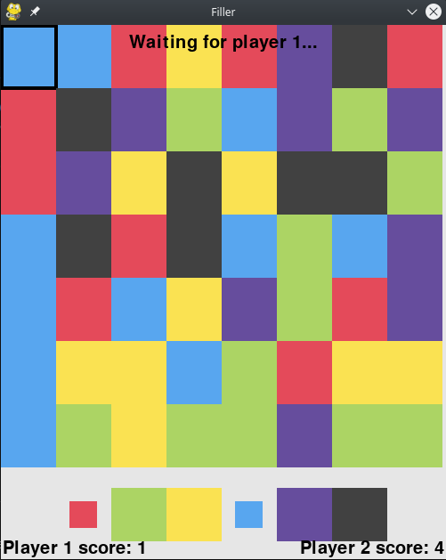

# Pygame-Filler

Pygame-Filler is an implementation of GamePigeon's Filler. This program allows you to play against another human or an AI. You can populate the board with an existing game and have the AI find the next best move to win against players on GamePigeon. The AI uses an alpha-beta pruning minimax approach. Click on a tile and use the keyboard to change its color, or click the bottom squares to play a move.

## Usage:

To run, execute `python3 main.py`

To display arguments, execute `python3 main.py -h`

For example, to play against an AI on a 10x10 board, execute `python3 main.py --width 10 --height 10 --player2 minimax`

## Screenshot

